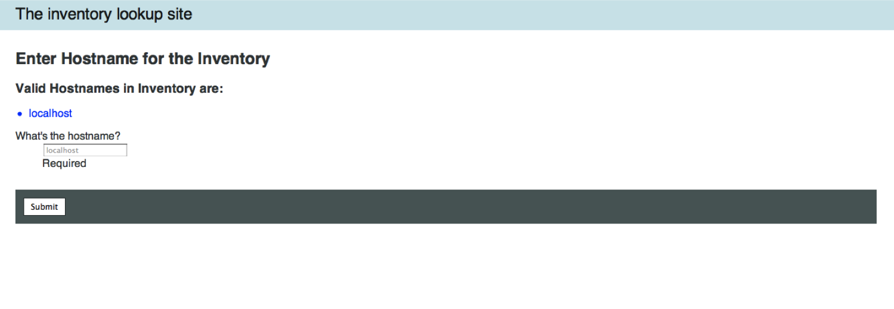

# Deploying a Play/Scala-based web application with Ansible

- Requires Ansible 1.2
- Expects CentOS/RHEL 6 hosts (64 bit)

### A Primer into Play Framework 
----------------------------------

- Play Framework: Play is a pure Java and Scala framework used to develop Web
Applications, It focuses on developer productivity, modern web and mobile
applications, and predictable, minimal resource consumption (CPU, memory,
threads) resulting in highly performant, highly scalable applications, Play
compiles Java and Scala sources directly and hot-reloads them into the JVM
without the need to restart the server.

- Akka: Akka is a toolkit and runtime for building highly concurrent,
distributed, and fault tolerant event-driven applications on the JVM.

- Scala: Scala is a general purpose programming language designed to express
common programming patterns in a concise, elegant, and type-safe way. Scala
smoothly integrates features of object-oriented and functional languages,
enabling developers to be more productive while retaining full interoperability
with Java and taking advantage of modern multicore hardware. Scala makes it
easy to avoid shared state, so that computation can be readily distributed
across cores on a multicore server, and across servers in a datacenter. This
makes Scala an especially good match for modern multicore CPUs and distributed
cloud-computing workloads that require concurrency and parallelism.

## Example Deployment using Ansible

This example deploys a very simple application which takes a hostname as a parameter
from the user and uses Ansible itself to gather and display facts from that machine.
It shows how to deploy a simple Play-based app, as well as how to call out to Ansible
from inside Scala.

Before running the playbook, modify the inventory file 'hosts' to match your
environment. Here's an example inventory:

        [webapp_server]
        play_server

Run the playbook to deploy the app:

        ansible-playbook -i hosts site.yml

Once the playbooks complete, you can check the deployment by logging into the
server console at `http://<server-ip>:9000/`. You should get a page similar to
image below.

## Fetching Facts from Hosts

To use the example webapp and fetch facts from a host, enter the hostname of
host as shown in the figure above and press submit. Please note that the
application uses Ansible to gather facts so the hosts should have SSH keys
set up and the host entry should be available in the Ansible inventory file in
/etc/ansible/hosts.

Upon submission, the application should return a valid json consisting the host
facts:

        localhost | success >> {
    "ansible_facts": {
        "ansible_all_ipv4_addresses": [
            "192.168.2.51"
        ], 
        "ansible_all_ipv6_addresses": [
            "fe80::5054:ff:fe58:776d"
        ], 
        "ansible_architecture": "x86_64", 
        "ansible_bios_date": "01/01/2007", 
        "ansible_bios_version": "0.5.1", 
        "ansible_cmdline": {
            "KEYBOARDTYPE": "pc", 
            "KEYTABLE": "us", 
            "LANG": "en_US.UTF-8", 
            "SYSFONT": "latarcyrheb-sun16", 
            "quiet": true, 
            "rd_NO_DM": true, 
            "rd_NO_LUKS": true, 
            "rd_NO_LVM": true, 
            "rd_NO_MD": true, 
            "rhgb": true, 
            "ro": true, 
            "root": "UUID=5202a2bc-1a30-424f-855b-5d51a3cba8df"
        }, 
        "ansible_date_time": {
            "date": "2013-05-25", 
            "day": "25", 
            "epoch": "1369483888", 
            "hour": "17", 
            "iso8601": "2013-05-25T12:11:28Z", 
            "iso8601_micro": "2013-05-25T12:11:28.551538Z", 
            "minute": "41", 
            "month": "05", 
            "second": "28", 
            "time": "17:41:28", 
            "tz": "IST", 
            "year": "2013"
        }, 

The facts can also be fetched by making a GET request with following url.

        http://<server-ip>:9000/inventoryID?hostname=<hostname>

